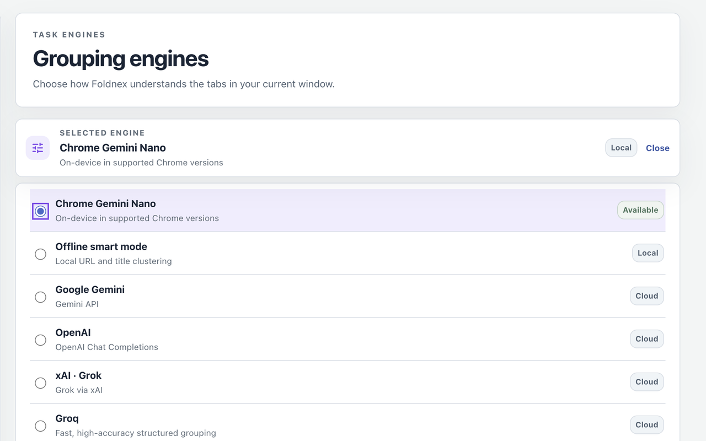
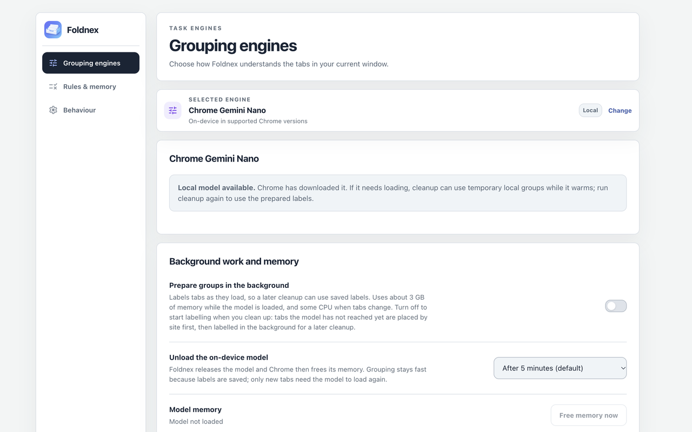
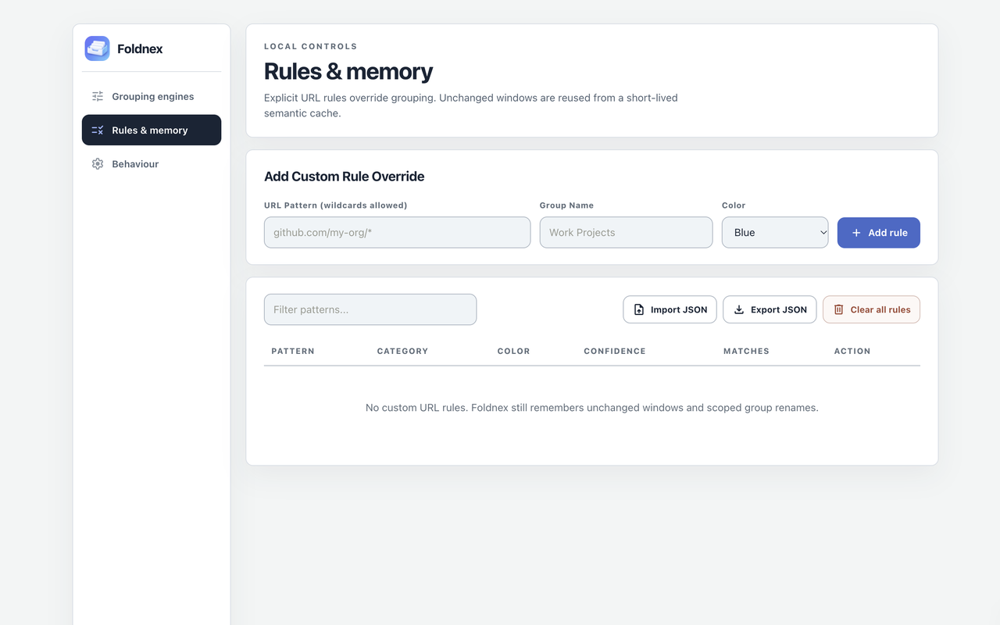
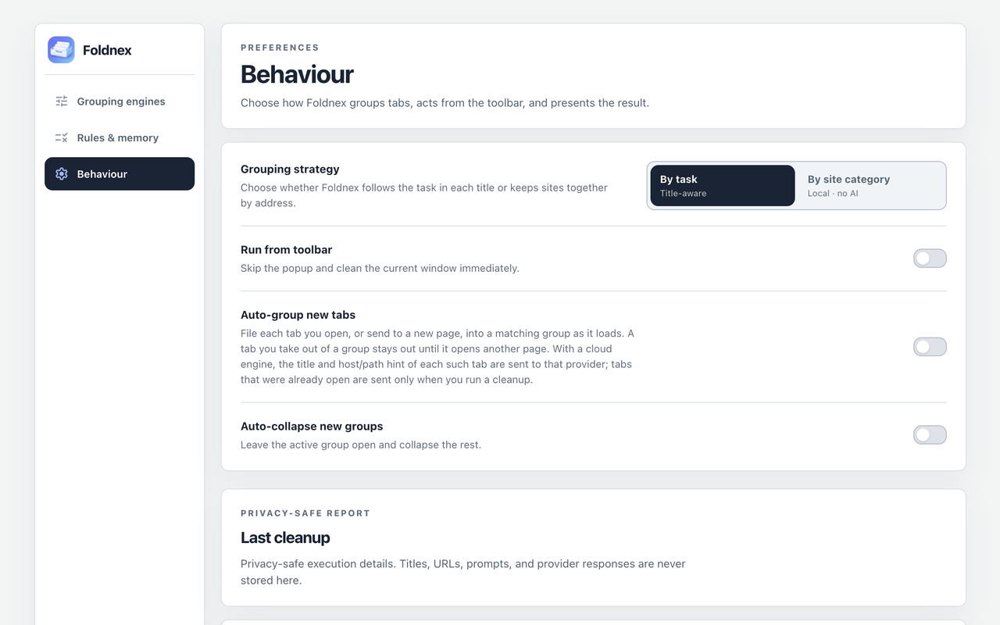
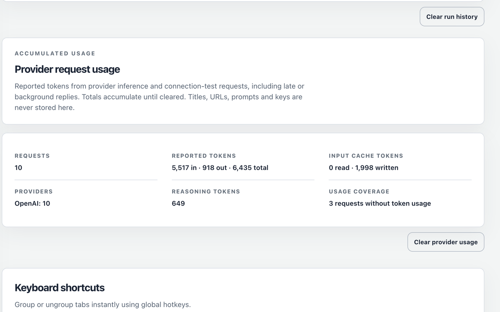

# Using Foldnex

Foldnex removes conservative duplicate pages and organises the remaining tabs in the current Chrome window. Cleanup closes redundant tabs. **Ungroup current window** removes groups, but does not restore closed tabs.

## Start with local grouping

1. Open Foldnex from Chrome's toolbar.
2. Choose **Offline — no AI** in the setup card for local title and address heuristics, or select **By site category** for address-based groups.
3. Select **Clean up and group**.
4. Use **Rules and settings** to change engines, add rules or inspect the cleanup report.

Neither of these local paths needs an API key or sends tab data to a cloud provider. The setup card remains until answered, but does not block cleanup. A new install initially selects Gemini Nano with By task; if its model is unavailable, cleanup uses local placement. Selecting **Offline — no AI** makes the offline engine your saved choice.

Duplicate cleanup prefers a pinned survivor, then the active tab, then the leftmost copy. It preserves query differences and routes in URL fragments, while ignoring ordinary document anchors. A small allowlist of stateless Chrome pages can also be deduplicated. Pinned and browser-internal tabs remain outside grouping.

## Choose a strategy and engine

| Choice | How tabs are classified | Setup and tradeoffs |
| --- | --- | --- |
| By site category | Local address-based categories and service names | No model, key or cloud request |
| By task: Offline smart mode | Local title, address and keyword heuristics | No model, key or cloud request |
| By task: Chrome Gemini Nano | Chrome's on-device model when available | Chrome/device eligibility and model download; can use several GB of memory |
| By task: Ollama | Model on your configured Ollama server | Local by default; a remote server receives tab inputs |
| By task: cloud engine | Your selected provider receives titles and host/path hints | Your own provider credentials; API charges may apply |

Cloud choices are Google Gemini, OpenAI, xAI, Groq, OpenRouter, DeepSeek and Cerebras. Local Ollama defaults to `http://localhost:11434`. A saved server address does not grant additional Chrome host permissions: requests still need to fit the packaged permissions and Chrome's network rules.

By task first classifies each tab, then plans groups locally. It normally aims for at most ten groups while preserving distinct topics. Explicit rules, Socials and remembered user names are protected and can exceed the ordinary ceiling; when locked groups fill the limit, remaining tabs can form one extra group. By site category has no ten-group ceiling.

Renaming a Chrome tab group teaches Foldnex your name for matching tabs. Model names are validated locally. Your own names are kept as typed within the runtime's length limits, so avoid sensitive information in group names you may later share.

## Configure a cloud provider

1. Open **Rules and settings → Grouping engines** and select a provider.
2. Enter its API key or supported bearer token.
3. Choose from the live model catalog, or use **Custom model** to enter an ID.
4. Choose reasoning effort if offered for that provider/model and save its settings.
5. Use **Test connection** beside the key to check the configuration with two synthetic tabs.

Catalogs refresh after credential changes and successful tests. **Refresh models** lets you request them again. A successful connection test does not prove current-window grouping will succeed, and a saved key alone is not a verified connection. Synthetic tests can still incur provider charges.

OpenAI's packaged default is `gpt-6-luna` at Low effort. **Priority processing** is on by default and requests the priority service tier, which can cost more. Turn it off to request the default tier, including for connection tests. Provider availability, returned service tier and billing remain under the provider's control.

**Cloud economy mode** is off by default. Enabling it skips optional cloud group naming and consolidation; category labels and local planning continue with remembered or deterministic names. It does not turn on background cloud work or change on-device naming.

API credentials are stored locally in trusted extension storage. Other settings may sync through Chrome. Rule export does not include credentials.

## Gemini Nano and model memory

Chrome must expose its Prompt API to Foldnex's service worker. Eligibility depends on Chrome, device, policy, storage and model availability; inspect the status in **Grouping engines**. Use the download/recheck control there when offered. Chrome's diagnostic page is `chrome://on-device-internals`.

Selecting Gemini Nano in the setup card enables background preparation. After setup, opening the popup can warm Nano when By task is selected, unless the unload choice is **Right after use**. A cleanup allows a bounded wait for a loading model, then places unlabelled tabs locally and reports provisional placement. On-device follow-up labels prepare a later cleanup; they do not immediately regroup those provisional tabs.

For Gemini Nano, **Background work and memory → Unload the on-device model** offers right after use, 2, 5, 15 or 60 minutes, or **Keep loaded**. Five minutes idle is the default. Right after use includes a short grace period; idle unload waits for active work. **Free memory now** releases Foldnex's base sessions; a prompt already running can finish on its own clone. Saved labels remain. If background preparation still has queued work, its next batch can load the model again.

Foldnex releases its sessions; Chrome controls when model memory is freed. An earlier Apple Silicon Mac test measured about 3 GB while loaded and a 15–25 second cold load. Other devices and Chrome versions can differ. **Keep loaded** lasts only as long as Chrome keeps the service worker running. Local Ollama receives the same unload preference as `keep_alive`, subject to its server's support.

## Background preparation and Auto-group

These are separate settings:

| Setting | Engines and scope | Effect |
| --- | --- | --- |
| Prepare groups in the background | Gemini Nano or local Ollama, By task, non-incognito windows | Labels open tabs and later page loads on this device for future cleanup |
| Auto-group new tabs | Gemini Nano, Ollama or cloud engines, By task, non-incognito windows | Files tabs opened or navigated after enabling it into matching groups as they load |

Background preparation is off until enabled in Settings or by choosing Gemini Nano during setup. Auto-group keeps on-device preparation active even if the separate preparation switch is off. When local preparation is allowed, existing tabs across non-incognito windows are queued when it is enabled, at Chrome startup and after installation/update. Opening the popup prioritises its window.

With both switches off, an on-device cleanup still labels tabs it placed provisionally for a later cleanup, then stops. This follow-up does not move those tabs immediately.

With a cloud engine, Auto-group sends the title and host/path hint of each eligible new page to that provider. Enabling it does not send all already-open tabs. A tab you manually take out of a group stays out until it opens another page. Restored tabs at browser startup are not treated as newly opened pages for cloud Auto-group.

Incognito tabs are excluded from background preparation and Auto-group. A manual cleanup in an incognito window uses its own boundary; a selected cloud engine can still receive that window's titles and URL hints.

## Rules and memory

In **Rules & memory**, add a URL pattern, category/group name and colour. Patterns are case-insensitive, use `*` as the only wildcard, and allow up to 200 characters. Other punctuation is literal. Rules override ordinary classification. Incognito cleanup does not read saved rules.

Use **Import JSON** and **Export JSON** to transfer authored rules. Imports require a JSON array, validate each rule, and accept files up to 1 MB. Import merges by case-insensitive pattern and stops once the merged map reaches the 300-rule threshold; invalid entries are skipped. The manual Add rule path currently does not enforce that threshold. Exported patterns and names can contain private information, so review files before sharing them.

Per-tab labels are eligible for reuse for seven days, with up to 3,000 entries. Plan memory reuses user names for up to 90 days and model names/advice for 14 days; separate exact-cohort rename preferences retain up to 100 entries without age expiry. Expired entries can remain until a subsequent write removes them. Labels and plan matching use hashes, but saved group names can still reveal their subject. Switching models, effort or endpoints reassesses model-specific memory while user renames remain available.

Reset controls have different scopes:

| Control | What it resets |
| --- | --- |
| Clear all rules | Authored/learned rules, exact results, labels, plan memory and rename preferences; invalidates session window plans |
| Clear run history | Cleanup diagnostics |
| Clear provider usage | Inference/test request and reported-token totals |

Clearing rules does not clear provider credentials, engine preferences, cleanup history or usage totals. Work that started before a reset cannot restore usable old memory or cleared usage totals.

## Behaviour, shortcuts and reports

In **Behaviour**, **Run from toolbar** runs cleanup directly when you click Foldnex. Until the setup card is answered, the toolbar still opens the popup. **Auto-collapse new groups** leaves the active group open and collapses the rest.

| Action | Windows/Linux | macOS |
| --- | --- | --- |
| Clean up and group | Alt+G | Command+Shift+G |
| Ungroup current window | Alt+U | Command+Shift+U |

Review or change assignments at `chrome://extensions/shortcuts` if another shortcut conflicts.

**Last cleanup** reports the engine, source, outcome, latency, fallback, quality and reported tokens. Logical cleanup batches and provider HTTP requests are different counts: retries and late requests can affect usage without changing that report.

**Provider request usage** accumulates inference and connection tests, including late/background replies. Model catalogs and incognito requests do not contribute. It stores counts and reported tokens, not tab inputs, prompts, response bodies or credentials. Some replies omit usage, so totals are not a bill or a complete cost calculation. Group names in cleanup diagnostics can contain sensitive text even though raw tab titles and URLs are excluded.

These images use owner-supplied 2.0.0 screen captures. Model availability and usage figures show the captured state, not a guarantee for another device or account. Asset provenance and source captures are recorded in [the store asset manifest](../store-assets/manifest.json).

## Troubleshooting

- **Model loading or unavailable:** inspect the Nano status; let a download/load finish or choose Offline smart mode. Run cleanup again after labels have been prepared.
- **Cloud fallback:** check the provider, credential, model and reasoning selection; test with synthetic tabs before intentionally sending a real window.
- **Tab remains outside a group:** pinned/internal tabs are excluded. Check explicit rules, provisional placement and the selected strategy.
- **Auto-group is idle:** check By task, engine eligibility and the switch. Existing/restored tabs are not eligible cloud new-tab events; incognito tabs are excluded.
- **Memory remains after release:** Foldnex can release its sessions but Chrome controls model residency; inspect `chrome://on-device-internals`.
- **Change not visible in an unpacked install:** reload Foldnex at `chrome://extensions`, then reopen its popup/settings.

For a reproducible bug, follow [Support](../.github/SUPPORT.md) and use synthetic tab examples. See [Privacy](legal/privacy.md) for full data handling, [Terms](legal/terms.md) for product terms and the [product contract](architecture/product.md) for implementation details.
